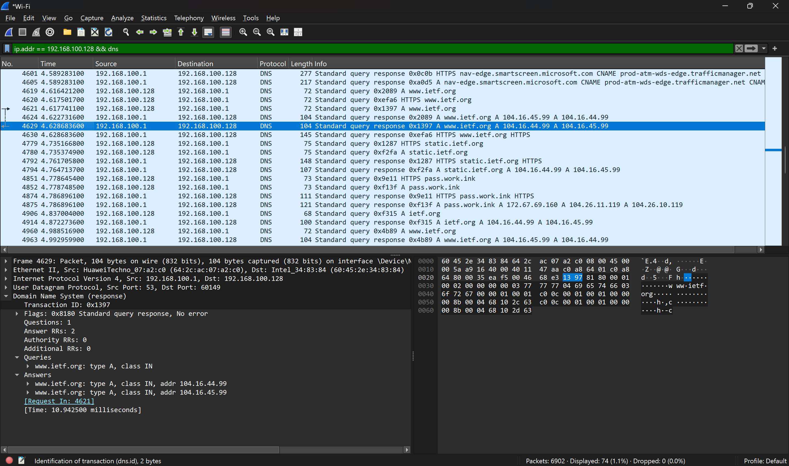
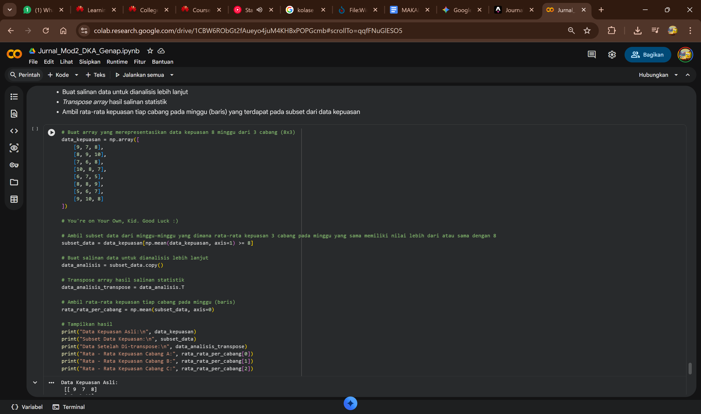
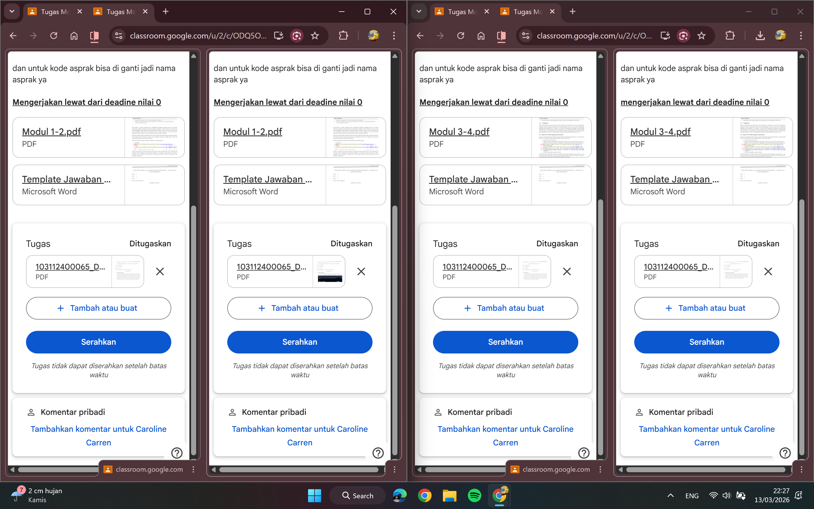

Minggu ketiga ini membawa nuansa yang berbeda. Seiring dengan tradisi mudik menjelang Hari Raya Idul Fitri, aktivitas perkuliahan pun bergeser sepenuhnya ke layar monitor melalui Zoom. Meskipun 'belajar dari rumah' memiliki tantangannya tersendiri—terutama dalam menjaga fokus—semangat eksplorasi teknologi tidak boleh kendor. Minggu ini menjadi saksi perjalanan saya menyelami paket data melalui Wireshark, merancang estetika antarmuka (UI), hingga mulai mencicipi ekosistem data science dengan Python.

## Ringkasan Aktivitas Mingguan (Minggu Ke-3)
| Hari | Fokus Aktivitas | Output | Durasi (jam) |
| :--- | :--- | :--- | :--- |
| Senin | Kuliah, Praktikum, Nugas | • Memahami dasar sintaks python, blind search   • Menyicil LaPrak DKA | 6,5 Jam |
| Selasa | Kuliah, Praktikum, Webianar, Nugas |   • Mempelajari langkah-langkah mendesain UI   • Mempelajari sintaks dasar Java   • Mendapatkan ilmu tentang big data   • Menyelesaikan Laprak PBO   • Menyelesaikan tugas DKA | 9 Jam |
| Rabu | Kuliah, Kuis, Nugas | • Mempelajari algoritma Greedy dan knapsack   •Menyelesaikan quiz Strategi Algoritma   • Menyelesaikan Laprak DKA | 6 Jam |
| Kamis | Kuliah, Nugas, Diskusi | • Memahami HTTP, DNS, dan penggunaan wireshark   • Menyelesaikan 2 modul Jarkom   • Diskusi pembagian tugas IMK | 8,5 Jam |
| Jumat | Nugas dan Kuis |   • Menyelesaikan 2 modul terakhir Jarkom   • Menyelesaikan quiz PBO | 4,5 Jam |

## Capaian Minggu Ini
Tuliskan pencapaian utama: 
1. Analisis Jaringan dengan Wireshark: Berhasil memahami cara kerja protokol melalui teknik packet sniffing.
2. UI Design Fundamental: Mempelajari alur desain yang berpusat pada pengguna (user-centered design).
3. Eksplorasi Data Science: Mengenal library NumPy untuk pengolahan array di Python—langkah awal menuju komputasi tingkat lanjut.
4. Wawasan Big Data: Mendapatkan perspektif baru melalui webinar JADESTA mengenai integrasi software dalam ekosistem data skala besar.
5. Fundamental Java: Memperdalam pemahaman tipe data sebagai pondasi sebelum masuk ke materi Advanced OOP.

## Progress Terhadap Target Semester
- Target Semester: Membangun portofolio digital yang komprehensif menggunakan Astro dan menguasai analisis efisiensi algoritma serta konsep Advanced OOP (Java).
- Progress saat ini: 20%
- Keterangan: Ada peningkatan 5% dari minggu lalu. Fokus minggu ini bergeser dari setup dasar website ke arah pemahaman alat analisis (Wireshark) dan library data (NumPy). Meskipun rencana belajar C++ di Codedex tertunda karena beban praktikum yang padat, pemahaman fundamental bahasa Java tetap berjalan sesuai jalur.

## Kendala Mingguan
- Akademik: Dalam memahami konsep HTTP butuh konsentrasi yang tinggi. Rencana minggu lalu yaitu belajar di Codedex tidak terlaksana.
- Teknis: Terlalu banyak tugas praktikum yang diberikan (4 modul dalam 1 minggu).
- Pribadi: Manajemen waktu yang masih kurang baik, Pembagian tugas besar yang kurang maksimal.

## Evaluasi Diri
Jawab reflektif:
- Apa keberhasilan terbaik minggu ini? Menyelesaikan 4 Modul dalam 2 hari
- Apa kesalahan terbesar minggu ini? Kurang efektif dalam pembagian waktu
- Apa strategi minggu depan? Lebih terjadwal lagi dalam manajemen waktu

## Rencana Minggu Depan
1. Target 1: Mempelajari course 2 C++ di Codedx